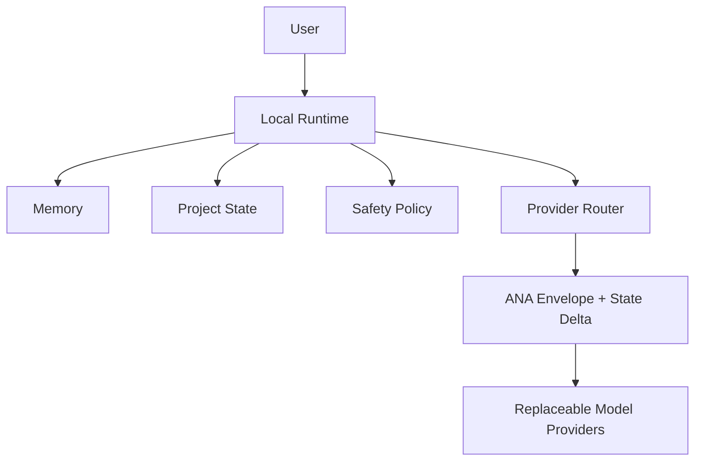

# ANA — Agent Network Architecture

> **Status: ANA v0.1 Draft / Experimental.** Not a production standard, finalized standard, or security-audited protocol.

English | [简体中文](README.zh-CN.md)

**ANA is a local-first state and interoperability protocol for replaceable AI models.**

It defines a small, testable boundary in which a user-controlled Local Runtime
owns Memory, Project State, and Safety Policy, while cloud or local models are
replaceable compute providers. The v0.1 minimal profile standardizes canonical
task envelopes and ordered State Delta handoffs; it does not make a model the
owner of a user's identity or history.

ANA is **not** a chatbot, model provider, encryption protocol, universal agent
framework, or a claim that every context can be compressed efficiently. It does
not replace [MCP](docs/related-work.md#mcp), [A2A](docs/related-work.md#a2a), or
other agent/tool protocols; it addresses a different boundary: local ownership
and portable expression of selected state across replaceable model providers.



## What v0.1 has and has not shown

| Verified within this repository | Not yet verified or included |
| --- | --- |
| Canonical `ana-core-chain` v0.1 task/frame and `project_state.upsert` State Delta handoff | Production deployment, formal standardization, or a security audit |
| Independent Python ↔ Java minimal-profile interoperability and rejection vectors | Real OpenAI ↔ Anthropic live interoperability or model-quality equivalence |
| Offline cross-provider state-continuity contract validation, with Local Runtime retaining policy control | Universal token/cost/latency improvement; Phase 4–5 found current gains come from state selection, not the envelope encoding |
| Provider-neutral Memory/Project State/Policy boundary in fixed vectors | Codon, compact Chain encoding, multi-agent coordination, cross-device conflict resolution, or a new Memory model |

## Quick start: run the conformance suite

Requirements: Python 3 and a JDK (the suite compiles the independent Java node
into a temporary directory). After cloning the repository, run:

```bash
python3 -m conformance.run_phase7_suite
```

You should see four passing tests covering both paths:

```text
Python Reference Node → Java Independent Node → Python Reference Node
Java Independent Node → Python Reference Node → Java Independent Node
```

The suite uses no API keys, network calls, or hidden local files. See the
[conformance guide](docs/conformance.md) to understand what passing means and
how to write a compatible implementation.

## Where to start

- [Documentation map](docs/README.md) — specification, experiments, security, limitations, and release maturity.
- [Core specification](docs/specification/README.md) — RFC-0001 through RFC-0005.
- [Conformance](docs/conformance.md) — minimal-profile requirements, vectors, and suite.
- [Related work](docs/related-work.md) — honest boundary comparison with MCP, A2A, Agent Protocol, Agent Host Protocol, Mem0, Letta, and portable-memory work.
- [Security considerations](docs/security-considerations.md) and [limitations](docs/limitations.md).
- [v0.1 Draft release notes](CHANGELOG.md) and [status](STATUS.md).

## Scope discipline

ANA v0.1 Draft is intentionally narrow. Its next public step is external
review of the RFCs and conformance suite—not implementation of Codon, compact
encoding, multi-agent behavior, cross-device synchronization, new providers,
new Memory models, or UI features.
