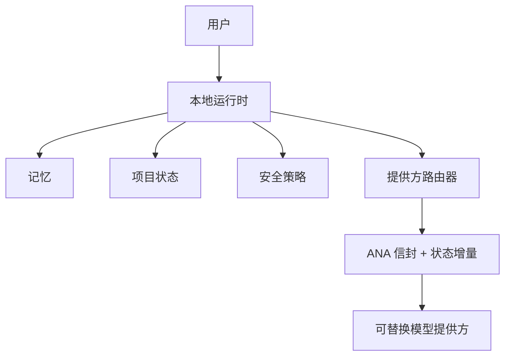

# ANA — Agent Network Architecture（智能体网络架构）

> **状态：ANA v0.1 草案 / 实验性。** 本协议不是生产标准、最终标准或经过安全审计的协议。

[English](README.md) | 简体中文

---

*本文是 ANA v0.1 规范的简体中文官方翻译。若本译文与英文规范存在歧义，以英文规范为准。*

---

**ANA 是一个面向可替换 AI 模型的本地优先状态与互操作协议。**

它定义了一个小型、可测试的边界：在此边界内，用户控制的本地运行时（Local Runtime）拥有记忆（Memory）、项目状态（Project State）和安全策略（Safety Policy），而云端或本地模型是*可替换的计算提供方（Provider）*。v0.1 最小配置文件标准化了规范任务信封（Task Envelope）和有序状态增量（State Delta）交接；它*不*让模型成为用户身份或历史的所有者。

ANA **不是**聊天机器人、模型提供方、加密协议、通用智能体框架，也不声称可以高效压缩所有上下文。它不替代 [MCP](docs/related-work.md#mcp)、[A2A](docs/related-work.md#a2a) 或其他智能体/工具协议；它解决的是一个不同的边界问题：**跨可替换模型提供方的本地所有权和所选状态的可移植表达**。



## v0.1 已证明与未证明的内容

| 本仓库内已验证 | 尚未验证或未包含 |
| --- | --- |
| 规范的 `ana-core-chain` v0.1 任务/帧和 `project_state.upsert` 状态增量交接 | 生产部署、正式标准化或安全审计 |
| 独立的 Python ↔ Java 最小配置文件互操作性及拒绝向量 | 真实的 OpenAI ↔ Anthropic 在线互操作或模型质量等价性 |
| 离线跨提供方状态连续性合约验证，本地运行时保留策略控制 | 通用 token/成本/延迟改进；Phase 4–5 发现当前收益来自状态选择，而非信封编码 |
| 在固定向量中实现提供方无关的记忆/项目状态/安全策略边界 | Codon、紧凑链编码、多智能体协调、跨设备冲突解决或新的记忆模型 |

## 快速开始：运行一致性测试套件

要求：Python 3 和 JDK（测试套件将独立 Java 节点编译到临时目录）。克隆仓库后运行：

```bash
python3 -m conformance.run_phase7_suite
```

您应看到四个通过的测试，覆盖两条路径：

```text
Python Reference Node → Java Independent Node → Python Reference Node
Java Independent Node → Python Reference Node → Java Independent Node
```

测试套件不使用 API 密钥、网络调用或隐藏的本地文件。参见[一致性指南](docs/conformance.md)了解通过测试的含义以及如何编写兼容实现。

## 从哪里开始

- [文档地图](docs/README.md) — 规范、实验、安全性、限制和发布成熟度。
- [核心规范](docs/specification/README.md) — RFC-0001 至 RFC-0005。
- [一致性](docs/conformance.md) — 最小配置文件要求、向量和测试套件。
- [相关工作](docs/related-work.md) — 与 MCP、A2A、Agent Protocol、Agent Host Protocol、Mem0、Letta 及可移植记忆工作的诚实边界对比。
- [安全考虑](docs/security-considerations.md) 和[局限性](docs/limitations.md)。
- [v0.1 草案发布说明](CHANGELOG.md) 和[状态](STATUS.md)。

## 范围纪律

ANA v0.1 草案的范围是有意收窄的。其下一步公开步骤是 RFC 和一致性测试套件的外部评审——*而非*实现 Codon、紧凑编码、多智能体行为、跨设备同步、新的提供方、新的记忆模型或 UI 功能。
